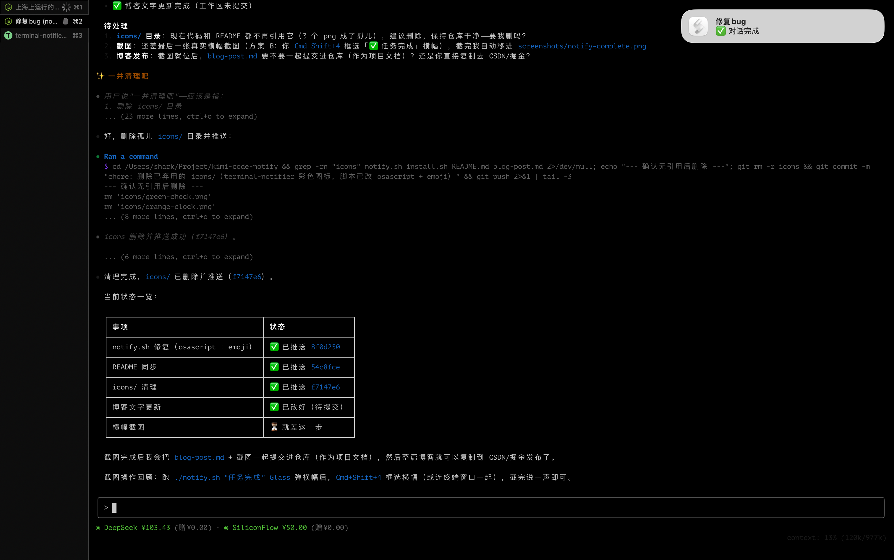
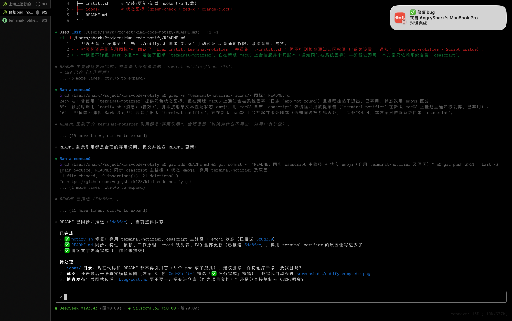

# 给 Kimi Code 装个「任务完成提醒」，再也不怕回来才发现任务早跑完了

先说说我为什么选 Kimi Code。它其实刚出没多久，但 CLI 模式我用着很爽：模型完全开放，能接入别家的；上下文管理做得也不错，多轮会话的压缩很顺，聊长了不迷糊。我现在基本只用 DeepSeek V4 Flash，token 省得厉害。唯一的缺憾是偶尔会撞上小 bug，不过这类问题自己用 AI 写个修复脚本就解决了，不算事。

天天用下来，有个特性我很喜欢：耗时的命令可以扔到后台跑，人就能切去做别的事，不用干等。

但很快我就发现一个问题：后台任务跑完，它是不会主动喊你的。我经常是开着别的窗口忙活半天，切回来一看，任务五分钟前就结束了。构建、测试、长一点的 agent 任务动辄跑十几分钟，人很容易就走神。等回头取结果，一大段等待时间就这么白白浪费了。

想过用自带的桌面通知，但对我来说它差两件事：一是任务成功、失败、超时、被终止，弹出来都长一个样，分不清；二是我经常人不坐在电脑前，通知弹了也看不到。

## Kimi Code 有 Hooks 机制

翻文档的时候发现，Kimi Code 支持 Hooks——在特定事件发生时执行一条外部命令，事件的输入还会通过 stdin 以 JSON 传进来。事件表里既有后台任务的通知（`Notification` 事件，带 `task.completed`、`task.failed`、`task.timed_out` 这类类型），也有对话回合的结束（`Stop` / `StopFailure` / `Interrupt`）。

思路一下就通了：在 `config.toml` 里挂上 hooks，事件一来就调一个脚本，让脚本去弹通知、放声音、做任何我想做的事。

## 写了个小脚本：kimi-code-notify

项目不大，就两个脚本。

`install.sh` 往 `~/.kimi-code/config.toml` 里写入 8 条 hooks——后台任务的 5 种终态（完成、失败、超时、被终止、丢失）加上对话回合的 3 种终态。写入的代码块带标记，重复安装不会叠加，想卸载一条命令就干净移除，还会自动备份原来的配置。

`notify.sh` 收到消息后，按消息内容匹配状态 emoji：

- 完成 → ✅
- 超时 → ⏰
- 失败 → ❌
- 被终止 → ⛔
- 丢失 → ❓

横幅实际长这样（emoji 状态 + 会话名）：



通知的标题直接用会话名。hooks 触发时会把会话信息通过 stdin 传给脚本，脚本解析出 `session_title` 当标题。同时开三四个会话也不怕分不清是哪条通知。

声音也按状态区分：完成是 `Glass`，失败是 `Sosumi`，超时是 `Funk`，被终止是 `Basso`，丢失是 `Ping`。后来发现不看屏幕、光听声音就能判断结果好坏——这算意外收获，比看文字还直观。

系统通知直接用 macOS 自带的 `osascript`，稳定不出幺蛾子。最开始其实想用 `terminal-notifier`——它支持自定义彩色图标，看起来很酷。结果在新版 macOS 上翻车了：通知被系统静默丢弃（日志里报 `app not found`），进程还会挂起不退出，脚本直接卡死在那里。查了半天才定位到，果断换回 `osascript`，状态改用 emoji 区分，反而更简单。降级链保留：`osascript` 不可用（比如 ssh 远程）就只播声音，再不行纯文本兜底。

## 怎么用

仓库在 GitHub：<https://github.com/Angryshark128/kimi-code-notify>

安装就三行：

```bash
git clone https://github.com/Angryshark128/kimi-code-notify
cd kimi-code-notify
./install.sh
```

`install.sh` 会把 8 条 hooks 写进 `~/.kimi-code/config.toml`，自动备份原配置，重复执行不会叠加，`-u` 一键卸载。写完 `/reload` 一下会话（或重启）就生效，之后任务结束就有通知、声音了。

想先手动试一次：

```bash
./notify.sh "测试通知" Glass
```

正常的话马上弹横幅、响一声；配了 Bark 的话手机同步收到一条。

生成的 hooks 长这样（后台任务部分），想自己加个事件照抄就行：

```toml
[[hooks]]
event = "Notification"
matcher = "task\\.completed"
command = "/path/to/notify.sh 任务完成 Glass"
```

## 顺手接了 Bark，手机也能收到

人在电脑前，通知加声音就够了。但人不在电脑前呢？任务失败、超时，得等回去才发现，那才真浪费时间。

Bark 是个开源的 iOS 推送服务，装个 App 拿一个设备 key，脚本里发个 curl 就行。我在 `notify.sh` 里加了可选支持：本机放一个 `bark.env` 配置文件，脚本检测到就推送，没配置就静默跳过，不影响原有行为。

系统横幅和推送的标题都带状态 emoji：✅ 完成 / ❌ 失败 / ⏰ 超时 / ⛔ 被终止 / ❓ 丢失 / ✋ 中断；Bark 推送还带副标题标注来源设备，iOS 通知按 `group` 分组可以单独折叠。多台机器都接上，也不会混。手机上的效果：



## 一点感想

这个项目本身很小，加起来不到两百行 shell，但它解决的是每天都在发生的真实摩擦。Kimi Code 的 Hooks 机制把「任务状态」这种内部事件暴露给了外部，一个小脚本就能接住，再把它变成自己想要的通知形式——emoji、声音、手机推送，全部可定制。

与其等官方把通知做得更贴心，我更愿意自己接管这一点。反正 hooks 就摆在那里，以后想加个会话结束的提醒、任务失败自动重试之类，照着格式加一行就行。

小工具的乐趣大概就在这：花一个下午，把每天都要遇到的别扭小事磨平，之后就再也不用想它了。
